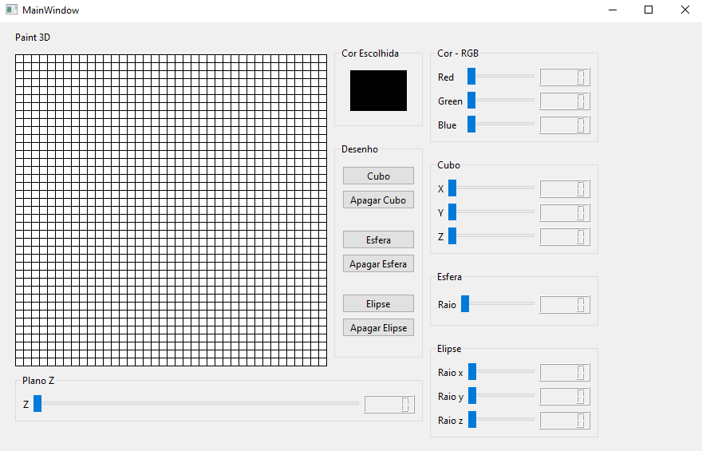
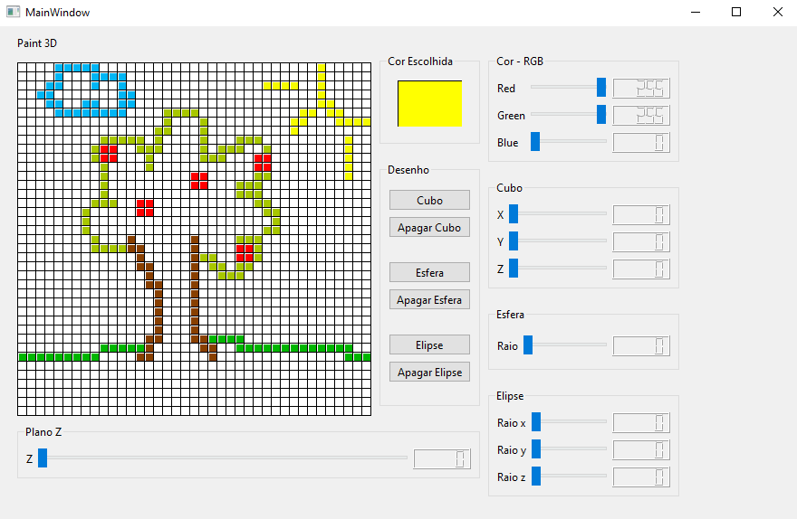

## Pré-requisitos

O novo projeto dessa vez, foi organizado a partir do Qt. Caso ainda não o tenha em sua máquina. faça seu download em:  https://www.qt.io/download 

A documentação do projeto pode ser acessada por meio da pasta HTML e acessar o index.

## Qt Creator
  
O Qt Creator é uma biblioteca de programação em C++ cujo principal objetivo é possibilitar o desenvolvimento de aplicações multiplataforma a partir de um mesmo código fonte.
Com o Qt Creator é possível criar programas usando a linguagem de programação C++ em sintonia com elementos de programação visual. Em outras palavras, os programas podem ser desenvolvidos arrastando e soltando componentes gráficos, aumentando o rendimento e facilitando a tarefa de novos usuários se habituarem com o ambiente de desenvolvimento.

## Descrição do projeto

Teremos, portanto, uma interface parecida com o software de criação de desenho Paint. Utilizaremos os códigos do projeto Sculptor Parte 1, e criaremos desenhos a partir de formas geométricas em formato 3D visualizando-os em planos. 
A foto abaixo demonstra a nossa interface do Paint 3D.

É possível desenhar nessa interface selecionando a forma geométrica e aplicando suas respectivas cores e dimensões. 

A criação desta interface foi feita baseando-se nos signals/slots e suas devidas conexões entre os componentes. Enquanto sua parte gráfica foi projetado para funcionar como uma matriz, assim, quando o usuário decide desenhar o seu click em um quadrado da área gráfica, referente a uma posição x, y e z da matriz, é preenchido por uma cor e seu formato selecionado.

## Desenvolvedoras

- Quelita Míriam, github: @quelita2
- Rosélia Nascimento, github: @roseliasilva
